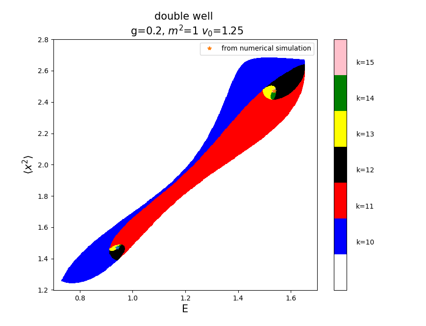
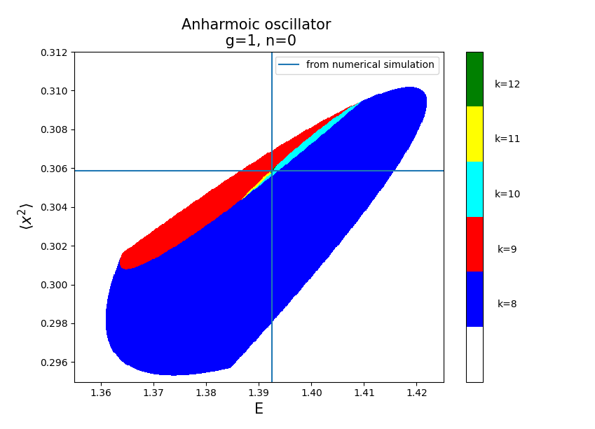

# Bootstrap_MQ

an example of boostrap tecnique applied to a simple system in the framework of quantum mechanics: anharmonic oscillators and double-well.

Starting from an hamiltonian like:

$$
\mathcal{H} = P^2 + V(x)
$$

Now choosing a basis of the energy eigenstates any operator $\mathcal{O}$ should obey the identity:

$$
\langle [ H, \mathcal{O}] \rangle = 0 \hspace{100 mm} \text{ and } \langle \mathcal{H}\mathcal{O}\rangle = E\langle \mathcal{O}\rangle
$$

From an accurate choos of $\mathcal{O}$ we can obtein the following relation:

$$
4nE \langle x^{n - 1} \rangle - 4n \langle x^{n-1} V(x) \rangle + n(n-1)(n-2)\langle x^{n - 3} \rangle - 4\langle x^{n} V^{'}(x) \rangle = 0
$$

 If we define a matrix: $M_{ij} = \langle x^{i+j} \rangle$ from the costrain $\langle \mathcal{O}^{\dagger} \mathcal{O} \rangle > 0$ writing

 $\mathcal{O} = \sum_i^{K} c_i x^i $  we have that $M$ must be positive definite.

So we compute this matrix for various parameter ad chek the sign of all eigenvalues. 

## Double well

## Anharmonic oscillator

